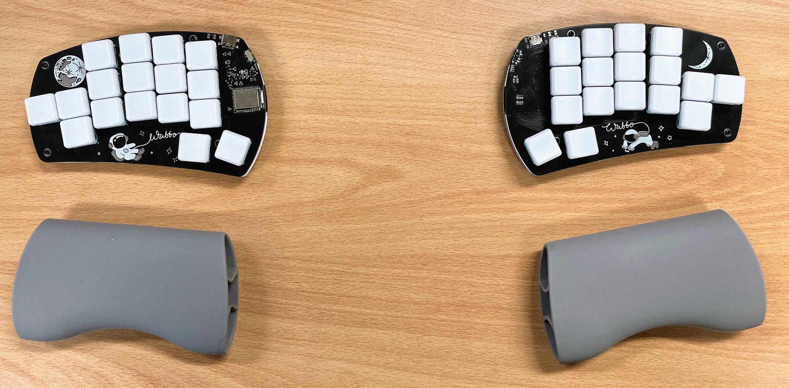
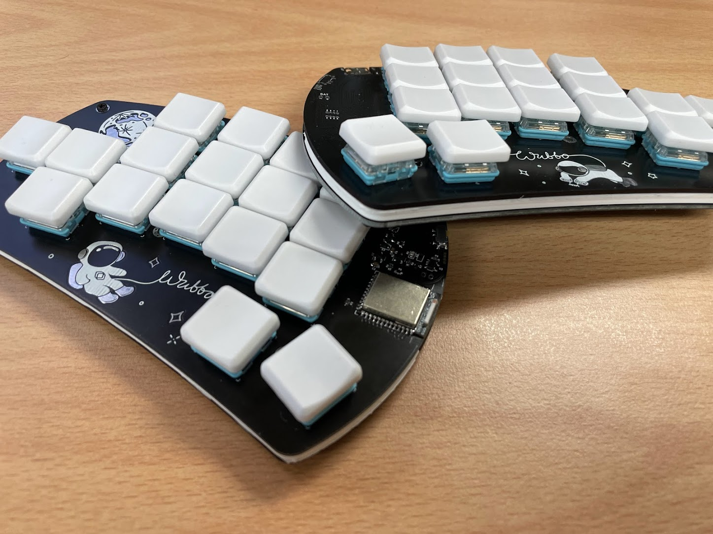

A wireless 34 key keyboard with the top pinky keys moved to the 6th column.

### [Interactive Bill of materials](https://cacheworks.github.io/Wubbo/)
### [Example ZMK config repo](https://github.com/mveerd/wubbo-zmk-config)

---
__Why move the top pinky keys to the side?__  

 Moving my pinky to the side instead of upwards feels more natural and limits the movement and rotation of my hands on the board.  
This 'pinky cluster' is inspired by boards like [balbuzard](https://github.com/brow/balbuzard) and [osprette](https://github.com/smores56/osprette)

__Who did the silkscreen art?__  
  
All credits for the handdrawn art go to Perce at [madebyperce.com](https://madebyperce.com/)  🙇
